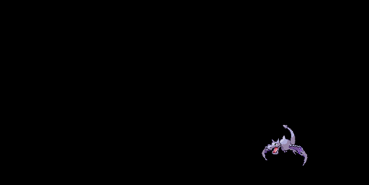
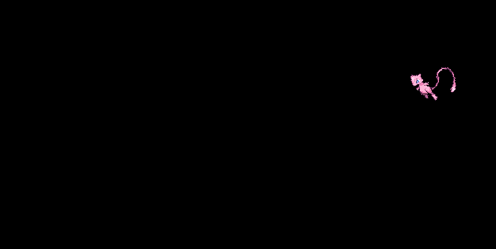
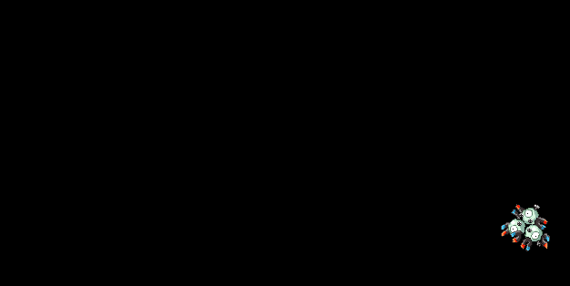
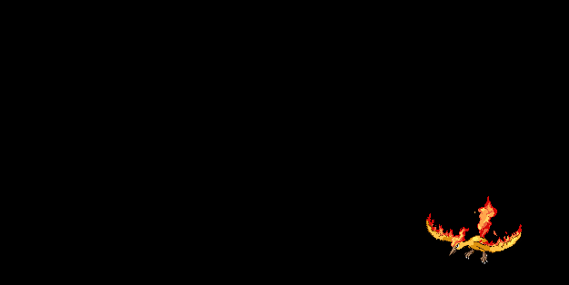

# Overview

SpriteSaver is a screensaver for displaying animated sprites. It is designed to be minimal, inspired by the familiar [bouncing DVD logo](https://www.bouncingdvdlogo.com/). It is configured as a module in [XScreenSaver](https://www.jwz.org/xscreensaver/) with settings to adjust the movement speed and animation delay.

- [Gallery](#gallery)
- [Installation](#installation)
- [Future Features](#future-features)


# Gallery

|  |          |
|:------------------------------------------------------:|:------------------------------------------------:|
|      |  |


# Installation

> [!NOTE]  
> This software was developed and tested on **Ubuntu 22.04**. Support for other platforms is listed in [Future Features](#future-features).

First, install XScreenSaver and [FFmpeg](https://ffmpeg.org/) if they are not installed already,
```
sudo apt install xscreensaver ffmpeg
```

Then clone and run `configure.sh`. This **only needs to be run once** as long as XScreenSaver is not uninstalled.
```
git clone git@github.com:henrynoyes/spritesaver.git
cd spritesaver && sudo ./configure.sh
```

### Importing Sprites

Find a pair of sprites in GIF format and place them in a new directory inside `sprites/`. Make sure both GIFs contain the **same number of frames**.

> [!TIP]
> For detailed instructions on installing Pokémon sprites, see [POKEMON.md](docs/POKEMON.md).

## Autobuild with Docker

To use `autobuild.sh`, make sure you have a working Docker installation. Then simply run,
```
sudo ./autobuild.sh sprites/sprite_name/left.gif sprites/sprite_name/right.gif
```

Open the XScreenSaver GUI by launching the `Screensaver` application or running the `xscreensaver-demo` command. Select SpriteSaver and modify the desired [settings](docs/SETTINGS.md).

To preview SpriteSaver, you can manually activate XScreenSaver with,
```
xscreensaver-command -activate
```

It can also be previewed in a floating window by running the binary,
```
./sprites/spritesaver
```

> [!NOTE]
> To view all installation methods, see [INSTALLATION.md](docs/INSTALLATION.md).


# Future Features

- [ ] Add support for walking sprites (random movements along bottom of the screen)
- [ ] Add support for floating sprites (slowly float in regions around screen)
- [ ] Add support for multiple sprites at once (allow for any combination of flying/walking/floating)
- [ ] Add adjustable frame rate in settings
- [ ] Test compatibility with other platforms (Ubuntu 20.04, macOS)